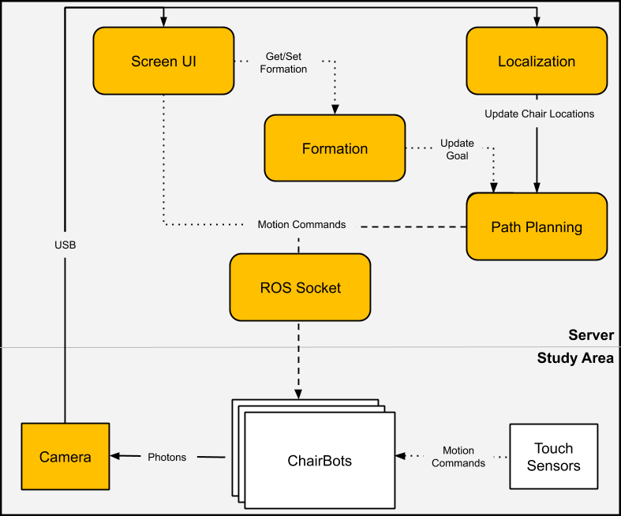

# Summary

This package is the ros package for teleoperating multiple chairbots via one central machine.
This package acts as the ros master and can connect to joysticks to control multiple chairbots.
It uses fiducials on the chairs to sense their locations.

# Features

## Current
  - Support for various screen sizes (including mobile via localhost)
  - Controllable via a joystick
  - Can control one or multiple chairbots
  - Fiducial tracking via webcam
  - Records chairbot location

## Planned
  - Collision avoidance
  - Arrangement memory and recall

# Quickstart

## Setup chairbots

### SSH into Raspi
Make sure that the raspi is set up to ssh properly and is active on the same interent connection

To find the ip address of the raspi, use a tool like nmap `sudo nmap -sS -p 22 192.168.10.0/24`
Or manually set it to a static value.

By default ours is set static to `192.168.1.73`

SSH into the raspi using the command `sudo ssh chairbot01@192.168.1.73`

On default raspi's the password will be `raspberry`

You now have terminal access to the chairbot Raspi

### Install ROS on Raspi

coming soon...

### Set up custom code
Copy the code from the `robots` folder into the raspi using scp. Eg `/home/chairbot01/catkin_ws/src/chairbot_neato/chairbot_neato_node`

Or clone the raspi code in this repo and only use the `robots` folder

Set it up to run with ros

`roslaunch chairbot_neato_node ui.launch`

## Setup server

`roslaunch chairbot_server start_ui_server.launch`

# Implementation

## Tracking
Fiducial (chairbot) locations are periodically saved in csv files in the ./.ros directory.
Each chairbot is given it's own file and is marked with the time the server started.
Eg: `/home/{user}/.ros/chairbotTracking-CB07-2020-07-13 10:39:41.443251.txt`.
This is the directory where ROS is running the python code during execution.

# Architecture

_Note: this text was originally written to be included in a paper but was moved here so the tone may be a little "off"_

To address the required features listed above, substantial architectural and control systems were designed and implemented. 

## Changes to System Architecture
These selected requirements required substantial software augmentations. Both FR1 and FR2 imply the existence of a feedback control system based on ChairBot location and orientation. FR4 requires both live video feed and a system to manage inputs and the execution of the UI.

To manage this additional computation, an external server was added to the system. This server was broken into modules described in the figure above . Each of these modules was given a discrete set of inputs and outputs and executed a specific purpose to conform to the single-responsibility principle of software development (SRP).

## Changes to Control Flow
Originally, the ChairBot had a single control flow consisting of physical sensors that sent motion commands. The final ChairBot system contains several additional control flows that send commands to the ChairBot in parallel. The result is semi-autonomous. By having these control subsystems work in parallel, a user can switch between mechanisms of control without having to reconfigure the system. However, this may result in situations where the robot receives contradictory commands. The UI contains checkbox toggles to disable software flows to mitigate this issue.

Interfaces throughout these control flows can be labeled as autonomous, human driven, or semi-autonomous. Human driven data consists of commands given by a user. Modules with both autonomous and human driven inputs result in semi-autonomous outputs. For example, the sensory image processing system consisting of the camera, server, and fiducial localization modules, seen in the figure, are driven autonomously. The path planning module inputs that information along with formation data propagating from user input. Therefore, the resulting motion commands sent to the ChairBot are considered to be semi-autonomous. A user can operate the ChairBot in a non-autonomous mode by disabling all autonomous systems which may be desirable for users with controlling personalities (commonly referred to in organizations as micro-managers).

## Enabling Technology Modules

The identified features were enabled using several modules. These include a system to track the ChairBot's location, a system to plan and adjust robot paths, and a web server system that could control the ChairBot remotely.

### Localization
The implemented localization system consists of fiducials placed on the seat of ChairBots and a camera sensor looking down from above. This design was chosen as the lab already had an overhead camera and experience with the fiducial library Aruco and computer vision library openCV (CV2). Fiducials are placed on the seat of the ChairBots facing up to track x/y coordinate location in the image and angle the chair is facing. This module enabled the sensing required needed to implement requirements FR1 and FR2.
% add image showing the camera's view
% does claim about commercial setting require a citation?

### Path Planning
To autonomously adjust the ChairBot's path, a system to calculate and execute movement commands was built. As an input, these ingested localization information and objective coordinates before publishing movement commands in ROS. These commands were streamed in parallel to the user's controls to the ChairBot system. From there the ROS module on the ChairBot moved it around [og ChairBot spec paper].  These commands were processed with every "packet" of localization data processed (corresponding to a "frame" or "still" of the video stream processed by the localization module. This module contained the brains needed to implement FR1 and FR2.

A simple path-finding algorithm was utilized that looked at the ChairBot's orientation and location. It adjusts the ChairBots' orientation by sending rotation commands. If, or when, a ChairBot is facing its goal coordinates, forward commands are triggered. When the ChairBot was near the target pixel location, a stop command was published.

### Formation
This module took in data from the UI and updated the Path Planning module's goal coordinates or orientation. Enabled FR2 in a special case where only orientation was set as a goal. It saved multiple goals. Was implemented as an endpoint the server which the UI could update and query via HTTP requests.

### ROS Socket
The ROS socket module is used by the server to wirelessly send commands to the ChairBot. It is subscribed to both the path planning and website modules. This is how the server communicates to the ChairBot. It forwards commands from the server by publishing them to ROS topics. Each ChairBot has it's own topic it subscribes to for listening for motion commands. This critical infrastructure enabled all features.

### Screen Interface
The screen UI controller was implemented using a Javascript/HTML website served by the server over HTTP. This design provided flexibility to the system such that in that could be used on a mobile phone, tablet, laptop, a PC, or a smart fridge (not tested). Such a HTML/CSS/Javascript website could even be packaged to run as native applications (Windows executable, MacOS bundle, Android or iOS app) using frameworks such as Iconic, or Electron [citation needed]. This design choice was inspired by the WORA (write once, run anywhere) philosophy popularized by a Java in 1995 [$http://www.stroustrup.com/1995_Java_whitepaper.pdf$]. As a whole, utilizing web development technologies in telerobotic system allows for rapid prototyping, flexible deployment environments, and access to a large supporting communities. 

The website is served from a Flask server which also streamed video from the overhead camera using CV2. JQuery was used to manage user input logic. The roslibjs package was used to send commands through the ROS socket. A stream from the camera was displaced as the website's background to give the user a second, objective view of the robot. The Javascript controls could operate independently of the video stream. 

# External Links
Chirbot Wiki for more information on getting started with the chairs https://github.com/abhiagni11/ChairBots_ROS_system/wiki
Charisma Lab Github for other chairbot projects

Snow white project that uses fiducials similarly https://github.com/charisma-lab/neato_localization/
  - image is processed in `tracking_aruco_markers.py`
  - then `localizing_tracked_markers.py` updates marker locations and publishes poses where applicable

# contributors
  - after 4/2020 Brett Stoddard  stoddardbrett@gmail.com
  - 1/2019-6/2019 Samarendra Hedaoo hedaoos@oregonstate.edu
  - 6/2018-4/2020 Abrar Fallatah fallataaa@oregonstate.edu
  - 6/2018-9/2018 Brett Alteria altenab@oregonstate.edu
  - 9/2017-6/2019 Abhijeet Agnihotri agnihota@oregonstate.edu
